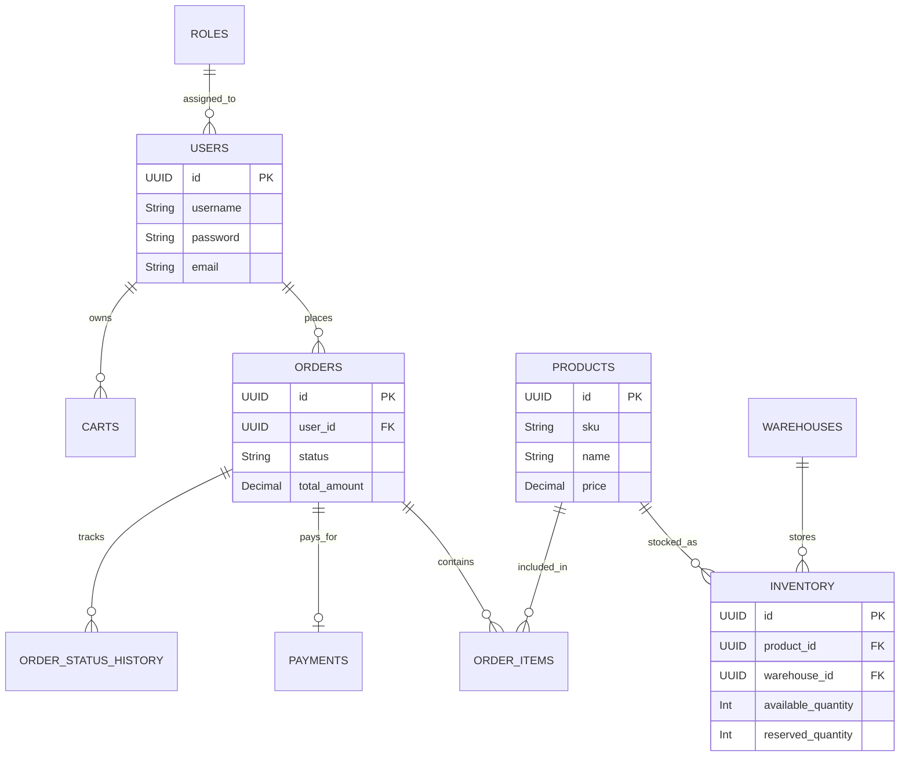
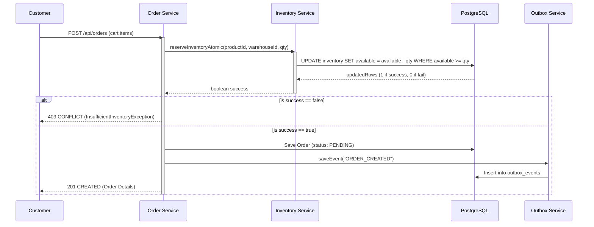

# Order Management & Inventory System

A robust, highly concurrent, and scalable backend system for managing e-commerce orders, product inventory, shopping carts, and payments. Built with cutting-edge **Java 21**, **Spring Boot 4.1.1** (Spring Security 7+), **PostgreSQL**, **Redis**, and **Kafka**.

## 🚀 Features

- **JWT Authentication & Role-Based Access Control**: Secure endpoints tailored for `CUSTOMER`, `WAREHOUSE_MANAGER`, and `ADMIN`.
- **Product Management & Redis Caching**: Fast catalog browsing backed by a highly performant Redis caching layer.
- **Bulletproof Inventory Concurrency**: Utilizes a highly optimized, atomic database locking strategy (`UPDATE ... WHERE available >= X`) capable of gracefully handling 100+ concurrent threads attempting to purchase the exact same stock simultaneously without deadlocks or overselling.
- **Transactional Outbox Pattern**: Guarantees atomic dual-writes (Database + Kafka Events) for all critical order state transitions.
- **Order State Machine**: Enforces strict lifecycle rules (PENDING -> CONFIRMED -> SHIPPED) and orchestrates inventory releases upon cancellation.
- **Mock Payment Gateway**: Simulates realistic unreliability (~10% random failure rate) and triggers the appropriate asynchronous compensation workflows.

---

## 🏗 Architecture & Diagrams

### 1. High-Level Architecture
The system is designed around a monolithic core that leverages asynchronous processing (Kafka) for non-blocking operations and Redis for read-heavy caching.

```mermaid
graph TD
    Client[Client (Web/Mobile)] --> API[Spring Boot REST API]
    API --> Auth[Auth Service (JWT)]
    API --> Product[Product Service]
    API --> Order[Order Service]
    API --> Inventory[Inventory Service]
    API --> Payment[Mock Payment Service]

    Product --> Redis[(Redis Cache)]
    Order --> DB[(PostgreSQL)]
    Inventory --> DB
    Payment --> DB

    Order --> Outbox[Outbox Table]
    Outbox --> Poller[Kafka Message Publisher]
    Poller --> Kafka[Kafka Topic: order-events]
    Kafka --> Consumer[Kafka Message Consumer]
    Consumer --> Notification[Mock Notification Service]
```

### 2. Database Entity Relationship Diagram (ERD)


### 3. Order Creation Sequence


---

## 🛠 Architectural Decisions & Scenarios

### 1. Inventory Concurrency Strategy
**Decision:** We rejected standard JPA Optimistic Locking (`@Version`) for the highly-concurrent checkout flow. Instead, we implemented **Atomic Database Updates** via a custom `@Modifying` query.
**Why?** Optimistic locking is great for low-contention environments (like a warehouse manager manually updating stock), but under extreme contention (e.g., flash sales, 100 concurrent threads), it throws constant `ObjectOptimisticLockingFailureException`s, forcing the application to retry continuously, tying up DB connections and CPU. The atomic query shifts the lock exactly to the DB row at the moment of execution, effortlessly preventing negative stock without complex application-level locks.

### 2. Transactional Boundaries & Event Publishing
**Decision:** We implemented the **Transactional Outbox Pattern**.
**Why?** If the Order Service directly calls `kafkaTemplate.send()` within its `@Transactional` block, a Kafka timeout could hold the DB transaction open indefinitely, or a DB commit failure could result in a phantom Kafka message being sent. By writing events to an `outbox_events` table in the *same* ACID transaction as the order creation, we guarantee perfect dual-write consistency.

### 3. Performance Scenario: Scaling to 5,000 requests/second
If the system expects a massive spike (e.g., Black Friday):
1. **Read Path:** `GET /api/products` is already cached in Redis. We would scale Redis into a cluster and add a CDN for static assets.
2. **Write Path (Inventory bottleneck):** The atomic DB update works well up to a point, but 5,000 TPS on a single row will cause lock contention at the DB level. We would shift to **Redis-based Inventory Reservations** (using Lua scripts for atomic decrements) to handle the firehose, and lazily sync the final state to PostgreSQL via Kafka.
3. **App Layer:** Horizontally scale the Spring Boot instances behind a Load Balancer (Kubernetes HPA) and drastically increase the HikariCP connection pool size or use a connection bouncer like PgBouncer.

### 4. Production Failure Scenario: Payment Service Downtime
If the 3rd-party Payment Gateway goes down entirely:
1. **Circuit Breaker:** We would implement **Resilience4j** around the `PaymentService.processPayment()` call.
2. **Graceful Degradation:** Once the circuit trips, the API immediately returns `503 Service Unavailable` with a user-friendly message ("Payments temporarily unavailable, please try again in 5 minutes") instead of tying up threads waiting for network timeouts.
3. **Queueing:** Orders remain safely in the `PENDING` state. We could optionally allow users to "queue" their payment, dropping a message into a Kafka `retry-payments` topic that a background worker slowly processes once the circuit breaker closes (recovers).

---

## 💻 Setup & Run Instructions

### Prerequisites
- Docker & Docker Compose
- Java 21+
- Maven 3.8+

### 1. Start Infrastructure (PostgreSQL, Redis, Kafka)
```bash
docker compose up -d
```
*(Wait 15-30 seconds for Kafka to fully initialize).*

### 2. Run the Application
The application uses Flyway, so the database schema will be automatically created on startup.
```bash
mvn spring-boot:run
```

### 3. Access API Documentation
Once the application is running, the Swagger UI is automatically generated and accessible at:
- **Swagger UI:** `http://localhost:8080/swagger-ui.html`
- **OpenAPI JSON:** `http://localhost:8080/v3/api-docs`

---

## 🧪 Testing

This project includes a comprehensive test suite.
To run the tests (which automatically utilizes Testcontainers to spin up isolated DB/Kafka instances):

```bash
mvn test
```

### The Concurrency Test
The most critical test is `InventoryConcurrencyIntegrationTest.java`. It spins up an ExecutorService with **100 concurrent threads** targeting exactly **10 units** of inventory, proving that the system successfully processes exactly 10 reservations, fails 90, and never drops the inventory below 0.
